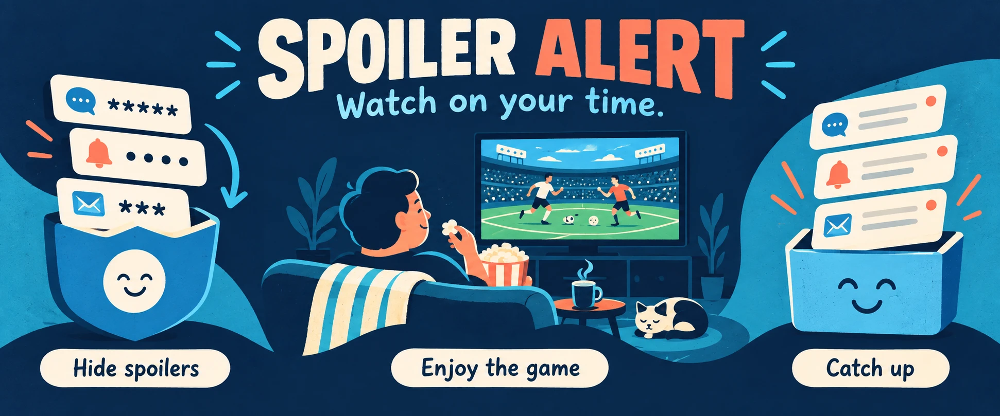

# Spoiler Alert



**Watch on your time.** Spoiler Alert holds matching sports notifications on your Android phone while you watch a recording. When you are ready, reveal them and catch up.

Follow teams, protect a single event, or add your own keywords. Check whether a game is over without seeing the score, ask a narrow question about an earlier moment, and use the catch-up tools to find a useful place to resume watching.

> **Start here:** You do not need to code, install developer tools, or have a GitHub account. On your Android phone, [open the latest release](https://github.com/jessecmaddox3/spoiler-alert-android/releases/latest), then download **spoiler-alert.apk** from its **Assets** list. Follow the steps below. Android 8 or newer is required.

I built this for myself and my personal use. I watch sports on a delay and wanted more control over when I see the notifications that come with them. This is the full app and the thinking behind it, shared with independently invented examples instead of my personal data. Make it your own, and feel free to improve mine. Hopefully it gives you a useful starting point, or at the very least some ideas. Cheers!

## Install it on your phone

1. Open the [latest release](https://github.com/jessecmaddox3/spoiler-alert-android/releases/latest) **on your Android phone**. Under **Assets**, tap **spoiler-alert.apk**. An APK is an Android app installation file. You can ignore the source-code ZIP files.
2. Open the downloaded file. If Android asks whether your browser or Files app may install unknown apps, allow it for this installation, then return and tap **Install**. You can turn that permission off afterward.
3. Open **Spoiler Alert**. Follow a team or add a keyword. Following something does not start hiding its notifications.
4. Use the setup button to open Android's **Notification access** settings and enable **Spoiler Alert**. This permission lets the app read and dismiss notifications so it can hold matching ones locally. Also allow its own notifications, which provide hidden-item notices and session reminders.
5. Try the guided sample notification in setup. It is an invented demo, so you can see the hide-and-reveal cycle before relying on it for a game.
6. On game day, choose an event and start hiding. When you finish watching, use **Stop & reveal**. Anything covered by another active event remains hidden.

**If Android says “Restricted setting”:** open your phone's **Settings → Apps → Spoiler Alert**, then the three-dot menu. If **Allow restricted settings** is available and you trust the release you downloaded, follow Android's prompts and return to Notification access. Menu names vary by phone; [Google's instructions](https://support.google.com/android/answer/12623953?hl=en) explain this additional permission step.

For an update, download the newer APK and open it, then tap **Update**. An update signed for the same app preserves its local data. Do not uninstall just to update: uninstalling removes the app's stored notifications and settings. The developer debug edition is a separate app.

If your phone keeps pausing the listener, open **Settings → Reliability** inside Spoiler Alert. It links to Android's notification-access and battery settings. The app cannot hide spoilers while Android has disconnected or paused it, and it cannot remove a notification someone has already seen.

## What is included

- **Your teams and events:** a bundled team/player reference catalog, followed interests, individual game protection, event discovery, recent completed games and custom keywords.
- **Local notification holding:** careful matching for messaging apps, broader matching for sports apps, app exclusions, optional package-wide fantasy protection, and a readable hidden/history view.
- **A complete watching session:** chosen duration, pregame reminders, a check-in near the end, one-hour extensions, a final grace period, and automatic stopping that keeps unrevealed content hidden.
- **Catch-up tools:** score-free event status, narrowly scoped live and historical questions, skip-ahead checks, soccer clocks and goal guides, and a catch-up summary. Missing or inconsistent provider evidence produces an unavailable answer rather than an invented safe interval.
- **Android conveniences:** individually reveal a hidden item, open its source when available, use the home-screen widget or Quick Settings tile, and inspect local diagnostic tools.
- **The full presentation:** the illustrated header carousel, local fonts, onboarding and accessibility labels. [Artwork and font notices](docs/ARTWORK.md) explain their provenance.

## What stays on your phone

Notification text, conversations, settings and hidden/revealed history stay in local app storage. Notification contents are not sent to an AI model, ESPN or another server. There is no account or analytics service.

Public schedule and game-status features make bounded GET requests to ESPN. Those requests disclose the requested public event and normal network information such as your IP address to that service. Matching and local holding can operate without fetching schedules, using custom keywords.

Automatic expiry never grants reveal permission. Each hiding period has its own durable identity; old reminders and delayed callbacks cannot borrow permission from a newly started period. Clearing revealed history removes its content while retaining minimal local identifiers needed to keep delayed callbacks sealed correctly. If a delayed notification has belonged to several hiding periods, future updates require explicit permission for each recorded period; revealing one group cannot erase another period's consent requirement.

Android does not let this app recreate another app's original notification or unread state. Spoiler Alert keeps a local copy of caught content and offers the source app's open action when it is still available. It does not control lock-screen previews already displayed by Android or another connected device.

## Build your own version

If you only want to use the app, the APK instructions above are all you need.

For development, install **Android Studio**, **JDK 17**, **Android SDK Platform 35** and its build tools. Open this repository as an Android Studio project. Set `ANDROID_HOME` to your SDK folder, or create an uncommitted `local.properties` containing `sdk.dir=/absolute/path/to/Android/sdk`.

```bash
git clone https://github.com/jessecmaddox3/spoiler-alert-android.git
cd spoiler-alert-android
./gradlew :app:testDebugUnitTest :app:lintDebug :app:assembleDebug
```

Android Studio's Run button installs the debug app on your selected emulator or connected device. Its application ID, `com.jessemaddox.spoileralert.opensource`, keeps it separate from the released app. The resulting file is `app/build/outputs/apk/debug/app-debug.apk`.

Run the database, migration and Android behavior checks on a disposable emulator:

```bash
./gradlew :app:assembleDebug :app:assembleDebugAndroidTest
adb install -r -g app/build/outputs/apk/debug/app-debug.apk
./gradlew :app:connectedDebugAndroidTest
```

The `-g` flag grants the disposable debug app its runtime notification permission.
The notification-effect tests need that permission on Android 13 and newer. This
setup applies only to your test emulator; real users grant permissions themselves
through the app's setup screens.

`assembleRelease` builds an unsigned APK. No production signing keys, credentials, private history or private repository is needed to build this code. Use your own application ID and signing identity for a separately distributed fork; the official release's signing identity is not part of this repository.

## Change it, share it, improve it

The project is [MIT licensed](LICENSE). Use it, modify it, redistribute it or build something commercial with it, while keeping the license notice. Fonts and dependencies retain their own licenses; see [NOTICE](NOTICE).

The architecture deliberately separates local notification handling from public sports requests. Keep network code in `schedule/`, and keep notification/vault content out of that package. [CONTRIBUTING.md](CONTRIBUTING.md) and [SECURITY.md](SECURITY.md) cover changes and reporting problems. [The design notes](docs/DESIGN.md) explain the important choices and how to work on the app with an AI coding assistant.
